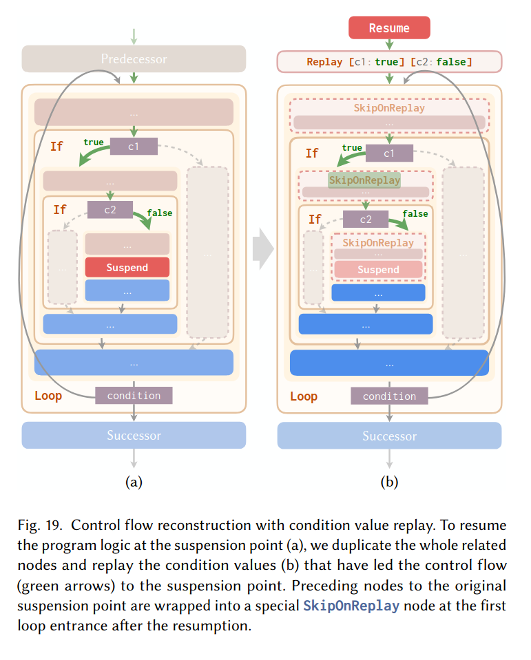
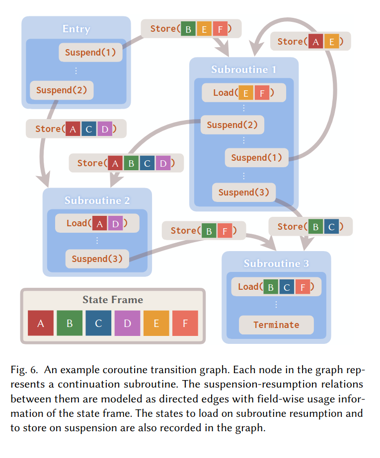

[GitHub Repo](https://github.com/buggy213/cs263-project)
[This document with pictures](https://github.com/buggy213/cs263-project/blob/master/docs/check-in.md)

# Project Idea
Investigate a basic formalization of a stackless, asymmetric coroutine splitting transform (inspired by the coroutine splitting from the LuisaCompute project, which is detailed in [[1]](https://cg.cs.tsinghua.edu.cn/people/~kun/2024/GPUCoroutines.pdf)). This part hasn't changed since I started

## Details
As previously mentioned, there are two main components to this:
1. Control flow splitting: take the CFG of the program and perform reachability analysis from special annotations (`suspend`), creating one "subroutine" from each suspend point. After the transformation, each `suspend` will cause control to return to a scheduler. The tricky part is to ensure that "resuming" from a subroutine is equivalent to as if the program never yielded at the suspend point in the presence of loops (dealing with conditionals is mostly straightforward). There are two approaches to this: "direct unrolling" and "condition replay". The "direct unrolling" approach basically works by unrolling the remainder of the current iteration of the loop, followed by the whole loop again. 

As an example, direct unrolling transforms
```
A;
while (cond1) {
    B;
    if (cond2) {
        suspend;
        C;
    }
    D;
}
E;
```
into
```
entry:
A;
while (cond1) {
    B;
    if (cond2) {
        frame.next_subr = 1;
        return;
        C;
    }
    D;
}
E;

subroutine 1:
C;
D;
while (cond1) {
    B;
    if (cond2) {
        frame.next_subr = 1;
        return;
        C;
    }
    D;
}
E;
```

```
entry:
A;
while (cond1) {
    B;
    frame.next_subr = 1;
    return;
    C;
    D;
}
E;

subroutine 1:
C;
D;
while (cond1) {
    B;
    frame.next_subr = 1;
    return;
    C;
    D;
}
E;
```

On the other hand, "condition replay" works by copying the (possibly nested) set of loops / conditionals leading up to a `suspend`, actually executing branches / loops leading up to suspend point, and using a new `SkipOnReplay` IR instruction to skip over the _first_ invocation of instructions that come prior to `suspend`. The main goal of this is to reduce code bloat that can be caused by unrolling from highly nested loops.  


2. Determining coroutine frame: once the program has been split into "coroutine scopes", the next step is to figure out which values need to be saved and restored within the "coroutine frame"; this allows live state to be passed between different subroutines. This involves doing dataflow analysis to determine which values a subroutine kills (overwrites), which ones it potentially modifies, and which ones it requires that haven't been overwritten by a previous instruction in the subroutine. With this information, a graph between subroutines with edges containing information about which values need to be kept alive across the transition between two subroutines can be created, and the coroutine frame can be constructed to hold this information. The IR is augmented with appropriate save / load instructions to and from coroutine frame. 



# Prior Discussion
During office hours, there was a suggestion to move to big-step operational semantics, make the primary inductive datatype handle sequencing, and simplify the available control flow to just `If`. I implemented all of these suggestions and they definitely helped in making the proof go through.

# Current Progress
As mentioned above, the design has changed quite a bit. The `StmtExt` and `StmtCo` now have the "Sequence" variant, which makes proofs about it simpler than working with flat `List` of instructions. `Switch` with `List (List Stmt)` is simplified to just `If` with only the `then` arm (`else` can just be an `If` with negated condition). 

```lean
inductive StmtExt : Type where
  | ShallowInstr (id: Fin n)
  | Sequence (head: StmtExt) (tail: StmtExt)
  | If
    (cond: List (Fin n) → Prop)
    (then_body: StmtExt)
  | Loop
    (cond: List (Fin n) → Prop)
    (body: StmtExt)
  | Suspend

inductive StmtCo : Type where
  | ShallowInstr (id: Fin n)
  | Sequence (head: StmtCo) (tail: StmtCo)
  | If
    (cond: List (Fin n) → Prop)
    (then_body: StmtCo)
  | Loop
    (cond: List (Fin n) → Prop)
    (body: StmtCo)
  | Yield (next: Fin k)
  | Skip
```

The operational semantics now follow big-step semantics as well. One of the challenges here is figuring out how to get yields to behave correctly in the coroutine semantics. My first try was to essentially copy the straight-line semantics, but have the `Yield` relation take in what the subroutine big-steps to.

```lean
| Yield (next: Fin k)
  (s t: State)
  (hsubr : @CoroutineStep program (program.subroutines[next]'(by simp [program.hsubr_count]), s) t) :
  CoroutineStep (StmtCo.Yield next, s) t
```

However, this doesn't really work on its own, you can consider a program like
```
A;
suspend;
B;
```

The result of splitting the program might look like
```
main:
(StmtCo.Sequence 
    (StmtCo.ShallowInstr 0)
(StmtCo.Sequence
    (StmtCo.Yield 0)
    (StmtCo.ShallowInstr 1)
))

subr_0:
(StmtCo.Sequence 
    (StmtCo.ShallowInstr 1)
    (StmtCo.Skip)
)
```

The main issue lies in the fact that the yield extends the big-step to what the subroutine does, so the state after yield is `[0, 1]`. But, the `Sequence` right above it still big-steps the other arm, and causes the state to be updated again to `[0, 1, 1]`. The way I dealt with this is to add a new field to inductive predicate which informs the "parent" whether or not a big-step contains a yield. If so, then it _skips_ big-stepping the trailing `StmtCo`. This also introduces a new proof burden, as the straightforward 1-1 correspondence between StmtCo and StmtExt is lost (well, if they were that simple, then the project would probably be too trivial). So, the inductive invariant needs to include what the accumulated `cont` within a call to `splitStmt` will step to.

With these changes, I was able to get the proof to go through. A big challenge was dealing with lean's unhappiness at doing dependent ι-reduction, and some contortions that needed to be done with generalizing out different variables, `split`ting through the definitions of `splitStmt`, etc., but the prover is happy so I am too. Overall, I think this was much harder than I expected, since the transformation is so simple on paper (and its implementation is also pretty simple too, I was able to get that working in under a day). I think mainly this is because learning lean from class is one thing, but actually using it to try and prove something is quite a bit more involved.

# Scope / Success Criteria
Proving the main theorem about "direct unrolling" strategy was a success. I think getting "condition replay" to work will be substantially trickier, but I am also more comfortable with doing these proofs now. Realistically, I'm not sure how much time I can dedicate to it though, since I am mostly focusing on finishing up my thesis. The dataflow / frame-content analysis is definitely out-of-scope at this point, as it is probably much more involved. I think one thing which is very achievable and might enhance the project without too much more effort would be a way to author and "run" the straight-line programs, as well as their coroutine counterparts. I already have some machinery for this as I built a pretty-printer to manually check the result of the algorithm, but actually "running" it would be cool too. 