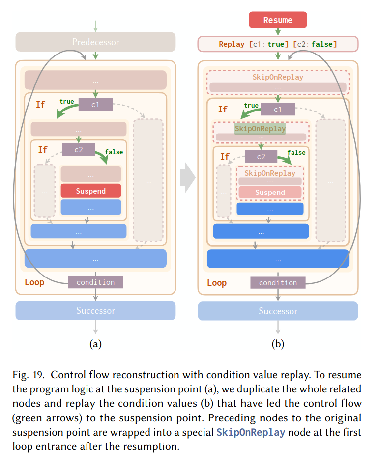
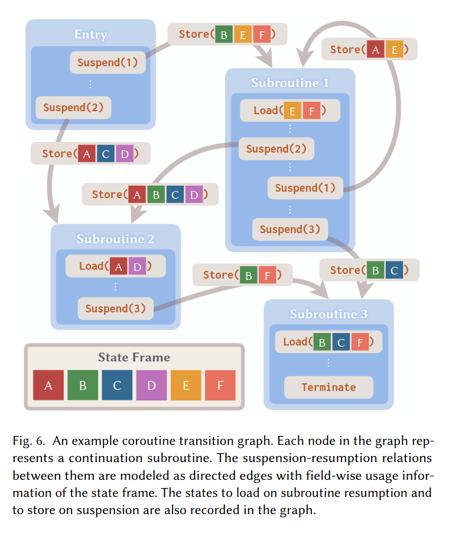

[GitHub Repo](https://github.com/buggy213/cs263-project)

# Software / Infrastructure
Mainly I will just be using `lean4` + `Mathlib`. I don't think other infrastructure is needed for the class project.

# Project Idea
Investigate a basic formalization of a stackless, asymmetric coroutine splitting transform (inspired by the coroutine splitting from the LuisaCompute project, which is detailed in [[1]](https://cg.cs.tsinghua.edu.cn/people/~kun/2024/GPUCoroutines.pdf)). 
There are two main components to this:
1. Control flow splitting: take the CFG of the program and perform reachability analysis from special annotations (`suspend`), creating one "subroutine" from each suspend point. After the transformation, each `suspend` will cause control to return to a scheduler. The tricky part is to ensure that "resuming" from a subroutine is equivalent to as if the program never yielded at the suspend point in the presence of loops (dealing with conditionals is mostly straightforward). There are two approaches to this: "direct unrolling" and "condition replay". The "direct unrolling" approach basically works by unrolling the remainder of the current iteration of the loop, followed by the whole loop again. 

As an example, direct unrolling transforms
```
A;
while (cond1) {
    B;
    if (cond2) {
        suspend;
        C;
    }
    D;
}
E;
```
into
```
entry:
A;
while (cond1) {
    B;
    if (cond2) {
        frame.next_subr = 1;
        return;
        C;
    }
    D;
}
E;

subroutine 1:
C;
D;
while (cond1) {
    B;
    if (cond2) {
        frame.next_subr = 1;
        return;
        C;
    }
    D;
}
E;
```

On the other hand, "condition replay" works by copying the (possibly nested) set of loops / conditionals leading up to a `suspend`, actually executing branches / loops leading up to suspend point, and using a new `SkipOnReplay` IR instruction to skip over the _first_ invocation of instructions that come prior to `suspend`. The main goal of this is to reduce code bloat that can be caused by unrolling from highly nested loops.  


2. Determining coroutine frame: once the program has been split into "coroutine scopes", the next step is to figure out which values need to be saved and restored within the "coroutine frame"; this allows live state to be passed between different subroutines. This involves doing dataflow analysis to determine which values a subroutine kills (overwrites), which ones it potentially modifies, and which ones it requires that haven't been overwritten by a previous instruction in the subroutine. With this information, a graph between subroutines with edges containing information about which values need to be kept alive across the transition between two subroutines can be created, and the coroutine frame can be constructed to hold this information. The IR is augmented with appropriate save / load instructions to and from coroutine frame. 



My goal for the project is to formalize a basic model of the IR that LuisaCompute uses (being primarily interested in control flow of the program) as well the operational semantics of running a program with and without coroutines. Then, I plan to implement some (or all, time and effort permitting) of these transforms and prove that the transforms preserve the correctness of the program. What this means is detailed more in other sections (and really most of all in `design.md` within the GitHub repo)

# Current Progress
Right now, I have a representation of both untransformed and transformed programs. Non-control instructions are modeled as just an `id`, and a list of these `id` are used to define the state of the program (shallow embedding). The untransformed program consists of a single list of statements annotated with special `suspend` statements, while the transformed program is represented as a list of statements (the privileged "entry" to coroutine) and a list of subroutines.

I have a small-step operational semantics defined for both the untransformed program as well as the transformed program. The operational semantics I chose for coroutine execution mostly mirrors the "straight-line" semantics, except that when a `Yield` instruction (produced by splitting transformation) is created, it updates the state with where the scheduler should take execution next. The scheduler is modeled extremely abstractly in my current model; it is modeled directly into the operational semantics as the rule
```lean
| Schedule trace next :
  CoroutineStep ([], ⟨trace, Option.some next⟩) (program.subroutines[next]'(by have len := program.hsubr_count; simp [len]), ⟨trace, Option.some next⟩)
```

Essentially, the scheduler just pushes more instructions from the pointed-to subroutine onto the configuration.

# Prior Discussion
During office hours, the question of "what does it mean for two CFGs to be equivalent?" was brought up. The approach I chose to deal with this is actually to essentially sidestep the problem entirely by representing the input program a tree-like inductive type in Lean. Thus, the trivial example of splitting a basic block in two by using a jump is entirely avoided, since the whole input is already treated as being normalized to one where this kind of trivial control flow does not happen. Thus, the "standard" approach for doing operational semantics (like we saw in class with **WHILE** language) + an even looser embedding of state can be used to define equivalency between programs, specifically using the reflexive transitive closure. The actual statement of the theorem I now have to prove is

```lean
-- "for all straight-line programs that halt, the final state is equal to the split program run using coroutine semantics"
theorem splitPreservesSemantics :
  ∀ (program : @ProgramExt n) (final_state: List (Fin n)) (hhalts: straight_line_rtc (program.stmts, ⟨[]⟩) ([], ⟨final_state⟩)),
  have split_program := (split program)
  coroutine_rtc (split_program) (split_program.main, ⟨[], .none⟩) ([], ⟨final_state, .none⟩) := by sorry
```

# What I don't know how to do yet
Right now, the basic prototype algorithm I have implemented is doing a "direct unrolling" approach. 
Even so, I am kind of struggling to prove the theorem I want about the correctness of it, and I imagine it will only be harder when I change it to "condition replay", and even more difficult when moving to a model where the values are not automagically transferred between different subroutines but instead need to be shuttled through the coroutine frame. I will try to work on these issues.

# Success Criteria
The minimum level I'd consider a success is to prove the above theorem, as it seems somewhat tricky already; the proof used in class definitely can't be carried over without modification. I'd like to also successfully model "condition replay". I consider the dataflow analysis + coroutine frame determination to be more of a stretch goal, since implementing that algorithm even without proving correctness is already probably the most nontrivial part of the actual algorithm...
